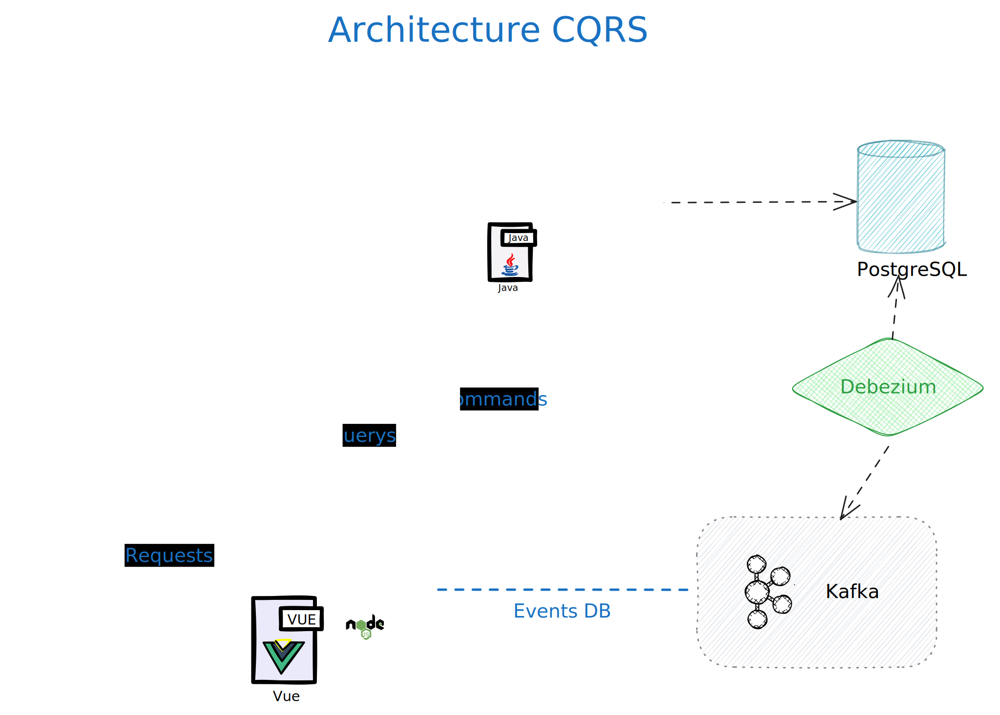

# Housekeeping v2 - CQRS

## Introducción

Este proyecto alberga un sistema de Housekeeping multi establecimiento para hoteles, desarrollado en un entorno de monorepo para facilitar la gestión de múltiples servicios y librerías. El enfoque inicial del proyecto se centra en la observabilidad utilizando OpenTelemetry, incluye la evolución hacia una arquitectura CQRS que permitirá comparar y evaluar ambas implementaciones.

## Configuración y Ejecución en entorno local

Para iniciar el proyecto:

```sh
# Arranca servicios docker:
node exec_infra.js

# Instalar dependencias:
node install.js

# Inicia Servicios:
node exec.js
```

### Url de servicios

- Housekeeping Web:  http://localhost:3000

- Housekeeping API: http://localhost:8080/swagger-ui/index.html#/

- Pruebas de carga (Locust): http://localhost:8089/  *En url, `http://IP:8080` hay que poner la IP local del equipo, localhost no funciona*.

- Observabilidad: http://localhost:3301/services  Signoz, el front para visualizar log, trazas y metricas.

### Prueba de carga

Las pruebas de carga se realizan con Locust, simula un escenario tipico de consulta de rack (habitaciones de establecimiento), cambio de estados limpia/sucia/supervisada

La DB esta poblada con:

- 200 Establecimientos.
- 1000 Tipos de habitaciones (5 por establecimiento).
- 40000 Habitaciones (200 por establecimiento)

## Estructura del proyecto

La estructura del repositorio es la siguiente:

- **`applications/`:** Contiene aplicaciones desarrolladas en Spring Boot y Node.js.
- **`shared-libraries/`:** Librerías compartidas entre las aplicaciones.
- **`infrastructure/`:**: Scripts y configuraciones para la infraestructura.
- **`scripts/`:**: Scripts para automatización y gestión del proyecto.
- **`documentation/`:**: Documentación, incluyendo este README.

Puedes consultar nuestra [Estructura de ejemplo](./documentation/structure.md)

### Identificadores de los modelos

En cuanto a los identificadores de los modelos, usaremos TSID para modelos que requieren acceso cronológico, aprovechando su ordenación por tiempo para mejorar la eficiencia en operaciones que dependen de la secuencia temporal. Por otro lado, emplearemos UUID para modelos donde la unicidad global y la independencia del tiempo son más importantes que el orden cronológico. Esta elección nos permite optimizar el rendimiento según las necesidades específicas de cada modelo.


### Arquitectura Apps java Spring Boot

**Estructura por Dominio con Subdivisiones Técnicas.** Esta estructura agrupa las clases y archivos basados en su dominio funcional (como "Establishment" o "Reservation"), subdividiéndolos luego en capas técnicas como controladores, servicios, modelos, value objects, y repositorios.

**DTOs.** Son conocidos y utilizados por los controladores y, en muchos casos, por los servicios, especialmente para casos de uso complejos que implican la combinación o transformación de datos.

**Entidades.** Representan los modelos de dominio y están mapeadas a la base de datos usando JPA.


## Observabilidad con OpenTelemetry

El proyecto implementa OpenTelemetry para proporcionar una observabilidad en todo los servicios. Esto incluye la recopilación de métricas, trazas y logs, permitiendo un monitoreo y análisis en tiempo real del comportamiento del conjunto del sistema. La configuración y el uso de OpenTelemetry están documentados en la sección de documentation/.

### Instrumentación 

Para instrumentar las aplicaciones, se puede hacer de forma manual o aprovechar que OpenTelemetry ofrece herramientas para la autoinstrumentación en la mayoría de los lenguajes, incluyendo sus bibliotecas, frameworks, JVMs, etc.

Para enviar métricas al colector Signoz, se ha optado por la autoinstrumentación.

En Java, gracias a los agents, podemos provisionar los servicios sin necesidad de modificar el código de la aplicación.

En Node, utilizaremos la precarga de módulos para cargar `instrumentation.cjs`, lo que permite instrumentar las principales bibliotecas.


## Implementación a CQRS

El implementa una arquitectura CQRS (Command Query Responsibility Segregation) junto a un sistema de Captura de Cambios de Datos (CDC).

Como CDC se utiliza Debezium y Kafka como sistema de mesajería.

**Integración con Debezium y Kafka:** La integración con Debezium y Kafka ha sido relativamente sencilla. Los ficheros de docker-compose proporcionan una guía clara sobre cómo se realiza esta integración. Debezium envía un evento a Kafka por cada operación de alta, baja o modificación en la base de datos, y crea un 'topic' específico para cada tabla. Esta funcionalidad es fundamental para el seguimiento eficiente de los cambios en los datos y facilita la implementación del patrón CQRS, al separar claramente las operaciones de lectura y escritura.

### Servicios

**housekeeping-service** Backend diseñado con Java Spring Boot 3.15, gracias a Debezium no sufre cambios. La Arquitectura se basa en una estructura por dominio con subdivisiones técnicas, utilizando DTOs y entidades mapeadas a la base de datos con JPA. La inclusión de varias dependencias en el fichero pom.xml refleja la complejidad y la modularidad de la aplicación. La responsabilidad es ofrecer una API y garantizar la integridad de datos he interactuar con la base de datos.

**'frontend-service'** Desarrollado utilizando Node.js, con el objetivo de demostrar la viabilidad de la instrumentación mediante OpenTelemetry en este entorno. Este servicio juega un papel crucial al centralizar todas las peticiones HTTP, redirigiendo los comandos al Backend 'housekeeping-service' y las consultas de lectura a la base de datos Redis.

Además, se ha integrado una interfaz web desarrollada con Vue.js, proporcionando una vista preliminar del aspecto visual de la aplicación.

## Arquitectura




## Casos de uso


\* Registro de tareas realizadas y Asignación de tareas no implementado

## Requisitos

Herramientas y software donde se ha probado el proyecto:

- node v20.10.0

- java 17.0.9

- mvn 3.9.5

- npm 10.2.4

- docker 24.0.7

### Configuración del Entorno

- Las aplicaciones Java están configuradas para arrancar en local.

- La base de datos se puebla automaticamente al inicio de `house-keeping-service` en entorno local.


